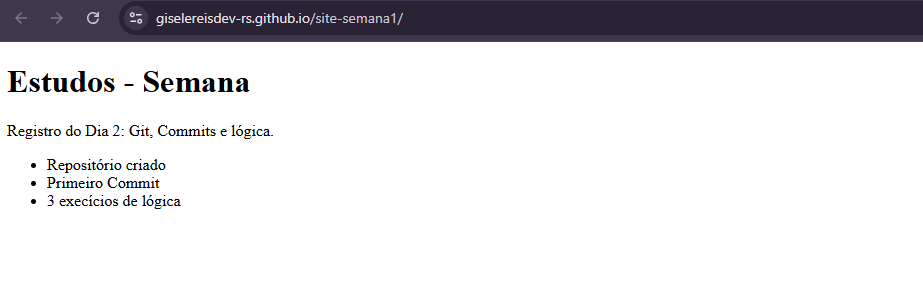

# 📘 Site Semana 1

Projeto de estudos para aprender **HTML, CSS e Git/GitHub**.  
Esse projeto faz parte da minha jornada de aprendizado em programação.

## 🚀 Demonstração
O site está publicado no GitHub Pages e pode ser acessado aqui:  
👉 [Clique para acessar o site](https://giselereisdev-rs.github.io/site-semana1/)

## 📂 Estrutura do projeto
- `index.html` → Página principal  
- `styles.css` → Estilos do site  

## 🛠️ Tecnologias utilizadas
- HTML5  
- CSS3  
- Git & GitHub Pages  

## 📸 Preview

---

Feito com 💜 por **Gisele Reis**
